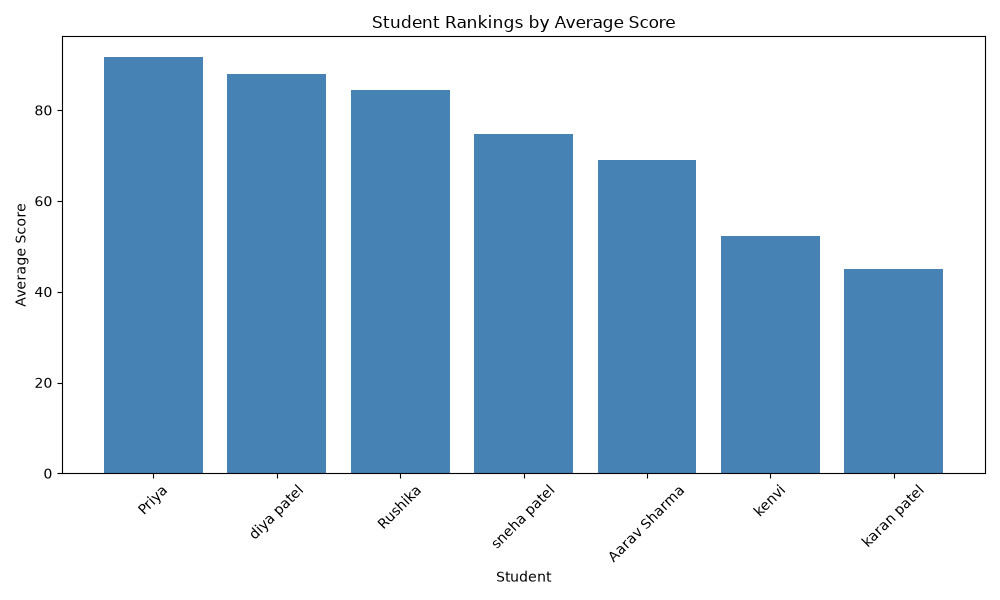
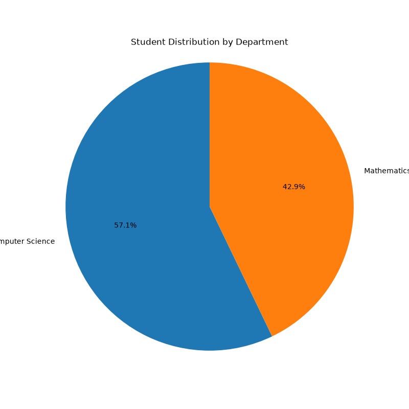
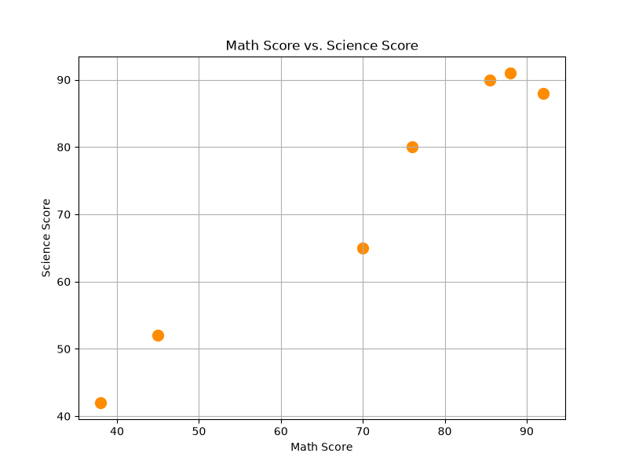
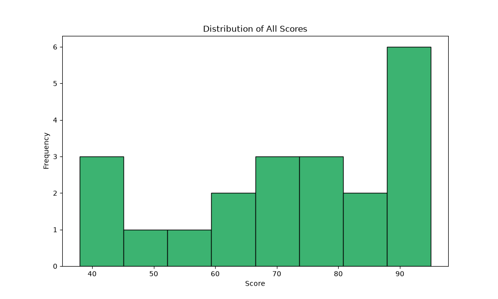

# Student Success Intelligence Platform

## Overview
A data-driven platform that helps students and faculty monitor academic performance,
identify weak areas, and generate actionable insights from educational data such as
attendance, marks, assignments, and quiz scores.

## Problem Statement
Most students only realize they are falling behind after examinations. This platform
uses data analysis and visualization to surface performance trends early, so students
and faculty can act before it's too late.

## Features (Completed)
- [x] SQLite database with students, subjects, and marks tables, including foreign key relationships
- [x] Student data model with full CRUD operations (Create, Read, Update, Delete)
- [x] Input validation and exception handling throughout
- [x] Command-line interface for general student management
- [x] Data Analytics using Pandas: class averages, subject-wise analysis, student rankings, weak-performer identification
- [x] Statistical analysis using NumPy: standard deviation, variance, correlation, GPA calculation, custom Performance Index
- [x] Visualizations using Matplotlib: bar charts, pie charts, scatter plots, histograms, line charts
- [x] Student Dashboard: login, profile, marks & GPA, performance chart, automated progress report
- [x] Faculty Dashboard: add/update/delete students, add marks, class analytics, weak-performer alerts
- [x] Automated unit test suite (7 tests) covering validation, duplicate handling, and foreign key enforcement
- [ ] Machine Learning predictions (final grade, academic risk) — future phase
- [ ] Web interface (Streamlit/Flask) — future phase

## Technology Stack
- **Language**: Python 3
- **Database**: SQLite
- **Libraries**: Pandas, NumPy, Matplotlib
- **Testing**: Python's built-in `unittest`
- **IDE**: VS Code
- **Version Control**: Git & GitHub

## Folder Structure

Student-Success-Intelligence-Platform/
- app.py
- requirements.txt
- README.md
- database/
- models/
- analytics/
- visualization/
- dashboards/
- tests/
- data/
- screenshots/
- docs/
- .gitignore

## How to Run This Project

1. Clone the repository:
git clone https://github.com/rushikapatel-016/Student-Success-Intelligence-Platform-.git
cd Student-Success-Intelligence-Platform-

2. Create and activate a virtual environment:
python -m venv venv
venv\Scripts\Activate

3. Install dependencies:
pip install -r requirements.txt

4. Initialize the database:
python database/db_connection.py

5. Run the general CLI:
python app.py

Or run a specific dashboard:
python -m dashboards.student_dashboard
python -m dashboards.faculty_dashboard

6. Run the automated test suite:
python -m unittest discover tests

## Screenshots

### Student Rankings

### Department Distribution

### Math vs. Science Correlation

### Score Distribution

## Documentation
Detailed, milestone-by-milestone documentation of the entire build process is available in the docs/ folder, along with ARCHITECTURE.md and ER_DIAGRAM.md.

## Future Improvements
- Machine learning-based grade and academic risk prediction
- Formal database-level linkage between marks and subjects tables
- Streamlit or Flask web interface
- Real authentication (passwords/sessions) for dashboard logins
- Deployment to the cloud

## Status
Core platform complete — built milestone by milestone as a structured learning project.